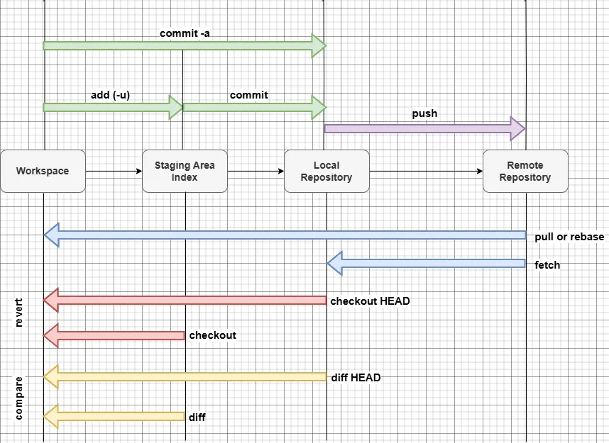

Git today is probably the most important tool to master as a developer. It doesn't matter what tech stack we use, which side of the application we work on (be it frontend or backend), knowing Git is very important. In this post covers we will try to look at some of the essential Git commands along with their usage scenarios.

---

## 1. `git init`
#### Scenario: Starting a New Repository
While beginning a new project and to use Git for version control, we initialize a Git repository using `git init`.
```sh
git init
```

**What `git init` Does?**

When we run git init inside a directory, it creates a hidden `.git/` folder, which contains all the metadata for the repository. It sets up the necessary files and structures so that Git can start tracking changes. The `.git/` folder includes:

- **HEAD** – Points to the current branch reference.

- **config** – Repository-specific configuration settings.

- **description** – Used in Gitweb but not commonly modified.

- **hooks/** – Contains scripts that can run at different stages of Git operations (e.g., pre-commit, post-merge).

- **info/** – Contains the exclude file, which works like .gitignore but is specific to this repository.

- **objects/** – Stores all Git objects (commits, trees, blobs).

- **refs/** – Stores references to commits, such as branches and tags.

This structure allows Git to manage and track the project's history efficiently. 

---

## 2. `git clone`
#### Scenario: Copying an Existing Repository
To collaborate on an existing project which might be hosted remotely, in order to clone the repository to your local machine we use this command.
```sh
git clone <repository_url>
```

---

## 3. `git add`
#### Scenario: Staging Changes Before Committing
Before committing changes, to move the modified or newly created files to the staging area.
```sh
git add <file> #Add individual files
git add . #Add all files
```



---

## 4. `git commit`
#### Scenario: Saving Changes with a Message
After staging changes, commit them with a meaningful message. It records the changes in Git history.
```sh
git commit -m "Added feature X"
```
---

## 5. `git status`
#### Scenario: Checking the Current Repository State
To see which files are staged, modified, or untracked.
```sh
git status
```
---

## 6. `git log`
#### Scenario: Viewing Commit History
To see past commits along with author and timestamp details.
```sh
git log
```
---

## 7. `git branch`
#### Scenario: Managing Branches
To create a new branch or list existing branches.
```sh
git branch <branch_name> #Create a new branch
git branch #List all branches
```
---

## 8. `git checkout`
#### Scenario: Switching Between Branches
To move to a different branch.
```sh
git checkout <branch_name>
```

---

## 9. `git merge`
#### Scenario: Merging Changes from Another Branch
To combine changes from another branch into the current branch.
```sh
git merge <branch_name>
```
---

## 10. `git rebase`
#### Scenario: Rewriting Commit History
To update a branch by moving its changes on top of another branch. Keeps a linear project history
```sh
git rebase <branch_name>
```
---

## 11. `git stash`
#### Scenario: Saving Changes Temporarily
To save changes without committing them. Allows temporary storage of changes before switching branches.
```sh
git stash
```

---

## 12. `git reset`
#### Scenario: Undoing Changes
To unstage changes or reset commit history.
```sh
git reset <file>
git reset --hard <commit_hash>
```
**Use Case:** Reverts changes based on the selected reset mode.

---

## 13. `git revert`
#### Scenario: Reverting a Commit
To undo a commit by creating a new commit.
```sh
git revert <commit_hash>
```
**Use Case:** Preserves history while rolling back changes.

---

## 14. `git cherry-pick`
#### Scenario: Applying a Specific Commit
To apply a commit from one branch into another.
```sh
git cherry-pick <commit_hash>
```
**Use Case:** Selectively brings changes into a different branch.

---

## 15. `git fetch`
#### Scenario: Retrieving Updates Without Merging
To get the latest changes from the remote repository.
```sh
git fetch
```
**Use Case:** Updates local metadata without modifying working files.

---

## 16. `git pull`
#### Scenario: Getting the Latest Changes from Remote
To fetch and merge changes from the remote repository.
```sh
git pull
```
**Use Case:** Synchronizes local code with the latest remote changes.

---

## 17. `git push`
#### Scenario: Uploading Local Changes to Remote
To share local commits with the remote repository.
```sh
git push origin <branch_name>
```
**Use Case:** Sends local changes to the remote repository.

---

## 18. `git tag`
#### Scenario: Marking Important Points in History
To create a tag for a specific commit.
```sh
git tag <tag_name>
```
**Use Case:** Labels significant versions like releases.

---

## 19. `git bisect`
#### Scenario: Finding a Buggy Commit
To perform a binary search to locate the commit that introduced a bug.
```sh
git bisect start
git bisect bad
git bisect good <commit_hash>
```
**Use Case:** Efficiently identifies faulty commits in large projects.

---

## 20. `git blame`
#### Scenario: Identifying Who Made a Change
To find out who last modified each line in a file.
```sh
git blame <file>
```
**Use Case:** Helps track changes for debugging and code review.

---

## Conclusion
These Git commands are essential for effective version control and collaboration. Mastering them will significantly enhance your development workflow. Whether you're just starting with Git or looking to improve your skills, practicing these commands will make managing repositories much easier.

Happy coding! 🚀

